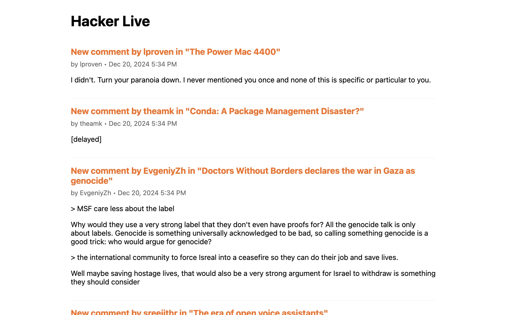

# Hacker Live Demo

Demo creating Web app using Golang and HTMX, deployed on VPS with Docker.

It is inspired by https://github.com/huytd/hacker-live

## How to deploy

#### 1. Use Docker Compose

Put the docker-compose.yml file into your VPS and just run
```
docker-compose up -d
```

#### 2. Use Kamal

- Edit the setting, add environment variables ...
- Deploy with `kamal setup` or `kamal deploy`


